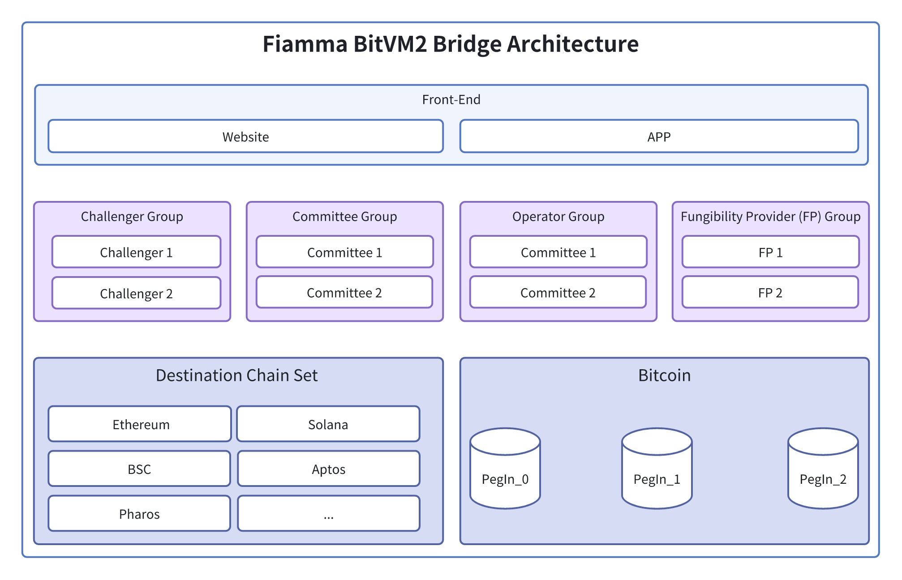

# CLI Tutorial

## Preparations

Before you can use CLI, you need to prepare the proof for testing, and a simple way to do this is to use the [fiamma git repository](https://github.com/fiamma-chain/fiamma/tree/main/prover\_examples) provides some sample prover code for generating test proof files, which can be used to easily generate test **proof** **public\_input** and **vk**.


Note! Fiamma currently supports zkp authentication with a variety of proofs, the list of supported proofs is shown in[ **Support ProofSystem.**](../supported-proofsystem.md) For the **bitvm proof system** , there is currently no open source specific prover, we give a sample generated by our test, soon we will open source bitvm proof system


### 1. Clone Fiamma Git repository

```bash
git clone https://github.com/fiamma-chain/fiamma

cd fiamma

git checkout <release-version>
```
## ZKPVerify Module

### 1. Send your proof to Fiamma network

**Submit BitVM proof**

The BitVM proof need the proof file, public input file and verifying key file. You may set gas and fees.

```bash
fiammad tx zkpverify submit-proof \
  --from <account_name> --chain-id <chain_id>  \
  --gas <gas> --fees <fees> \
  --node <node> \
  --keyring-backend test \
  <namespace> \
  <proof_system> \
  <proof> \
  <public_input> \
  <vk>
```

The current Fiamma network chain-id is `fiamma-testnet-1`, the namespace is `test-namespace`, the proof system is **`GROTH16_BN254_BITVM`** or **`FFPLONK_BN254_BITVM`** and the node is [https://testnet-rpc.fiammachain.io](https://testnet-rpc.fiammachain.io).

**Example** Proof system use **GROTH16\_BN254\_BITVM**.

Send BitVM proof:

```bash
fiammad tx zkpverify submit-proof \
  --from alice --chain-id fiamma-testnet-1  \
  --gas 20000000 --fees 2000ufia \
  --node https://testnet-rpc.fiammachain.io \
  --keyring-backend test \
  "test-namespace" \
  "GROTH16_BN254_BITVM" \
  ./prover_examples/bitvm/proof.bitvm \
  ./prover_examples/bitvm/public_input.bitvm \
  ./prover_examples/bitvm/vk.bitvm
```

### 2. Get Proof id

When you have finished submitting your proof, there are two ways to query the proof id of the proof you have submitted.

* **Get Proof Id by tx event**

When you submit a proof, you will receive a transaction hash. Typically, if the transaction is successful, by querying the transaction details using the hash, you can retrieve an event list where you can filter out the **proofId**.

```bash
fiammad query tx 65C110AE8E0624AC34CC1F7E36E253B3437B28E008433AE499DEF40D770A1915 --node https://testnet-rpc.fiammachain.io
```

<figure><figcaption><p>SubmitProof event</p></figcaption></figure>

* **Get Proof Id by Manual/Code Calculation**

The proof id can be calculated from `sha256sum` of proof inputs using shell. It Concatenate the proof system, proof, public input,and vk.

```bash
# the proof input files directory is fiamma/prover_examples/bitvm
: ${PROOF_FILE:=proof.bitvm}
: ${PUBLIC_INPUT_FILE:=public_input.bitvm}
: ${VK_FILE:=vk.bitvm}
: ${PROOF_SYSTEM:="GROTH16_BN254_BITVM"}
: ${NAMESPACE:="test-namespace"}
: ${PROOF_SYSTEM:="GROTH16_BN254_BITVM"}

NEW_NAMESPACE=$(echo -n $NAMESPACE | xxd -p)
NEW_PROOF_SYSTEM=$(echo -n $PROOF_SYSTEM | xxd -p)
NEW_PROOF=$(xxd -p -c 256 $PROOF_FILE | tr -d '\n')
NEW_PUBLIC_INPUT=$(xxd -p -c 256 $PUBLIC_INPUT_FILE | tr -d '\n')
NEW_VK=$(xxd -p -c 256 $VK_FILE | tr -d '\n')

# Concatenate the namespace, proof system, proof, public input, and vk
allDataHex="${NEW_NAMESPACE}${NEW_PROOF_SYSTEM}${NEW_PROOF}${NEW_PUBLIC_INPUT}${NEW_VK}"

echo -n "$allDataHex" | xxd -r -p | sha256sum | awk '{print $1}'
```

### 3. Submit community verification to Fiamma network&#x20;

The community verification need an proof id and verification result.&#x20;

submit community verification:

```bash
fiammad tx zkpverify submit-community-verification \
  --from <account_name> --chain-id <chain_id>  \
  --gas <gas> --fees <fees> \
  --node <node> \
  --keyring-backend test \
  <proof_id> \
  <result>
```

**Example** You may use the above shell to calculate a proof id, and use fiammad command to sumbit community verification with a verification result.

```bash
fiammad tx zkpverify submit-community-verification \
  --from alice --chain-id fiamma-testnet-1  \
  --gas 20000000 --fees 2000ufia \
  --node https://testnet-rpc.fiammachain.io \
  --keyring-backend test \
  1776686b821785672155f4f34a0cf0d088e721e3ec5ff32709a7cec1b5a3b669 \
  true
```

In addition, we provide shell scripts to make it easier to send these commands. The parameter accepted by the script is account.

```bash
// Assuming you are currently in the root directory at fiamma
./scripts/cli/submit_community_verification_bitvm.sh alice
```

### 4. Get proof data by proof id from Fiamma network

You can query proof data stored in the fiamma network by proof id.

```bash
fiammad query zkpverify get-proof-data \
  --chain-id <chain_id>  \
  --node <node> \
  <proof_id>
```

**Example**

```bash
fiammad query zkpverify get-proof-data \
  --chain-id fiamma-testnet-1  \
  --node https://testnet-rpc.fiammachain.io \
  1776686b821785672155f4f34a0cf0d088e721e3ec5ff32709a7cec1b5a3b669
```

### 5. Get bitvm chanllenge data by proof id from Fiamma network

You can query bitVM chanllenge data stored in the fiamma network by proof id.

```bash
fiammad query zkpverify get-bitvm-challenge-data \
  --chain-id <chain_id>  \
  --node <node> \
  <proof_id>
```

**Example**

```bash
fiammad query zkpverify get-bitvm-challenge-data \
  --chain-id fiamma-testnet-1  \
  --node https://testnet-rpc.fiammachain.io \
  1776686b821785672155f4f34a0cf0d088e721e3ec5ff32709a7cec1b5a3b669
```

### 6. Get verify result from Fiamma network

You can query proof verify status stored in the fiamma network by proof id.

```bash
fiammad query zkpverify get-verify-result \
  --chain-id <chain_id>  \
  --node <node> \
  <proof_id>
```

**Example**

```bash
fiammad query zkpverify get-verify-result \
  --chain-id fiamma-testnet-1  \
  --node https://testnet-rpc.fiammachain.io \
  1776686b821785672155f4f34a0cf0d088e721e3ec5ff32709a7cec1b5a3b669
```

### 7. Get verify result by namespace from Fiamma network

You can query proof verify status stored in the fiamma network by namespace.

```bash
fiammad query zkpverify get-verify-results-by-namespace \
  --chain-id <chain_id>  \
  --node <node> \
  <namespace>
```

**Example**

```bash
fiammad query zkpverify get-verify-result \
  --chain-id fiamma-testnet-1  \
  --node https://testnet-rpc.fiammachain.io \
  "test-namespace"
```

### 8. Get pending proofs from Fiamma network

You can queries a list of pending proof verification items in the fiamma network.

```bash
fiammad query zkpverify pending-proof \
  --chain-id <chain_id>  \
  --node <node>
```

**Example**

```bash
fiammad query zkpverify pending-proof \
  --chain-id fiamma-testnet-1  \
  --node https://testnet-rpc.fiammachain.io
```

### 9. Get pending proofs by namespace from Fiamma network

You can queries a list of pending proof verification items by namespace in the fiamma network.

```bash
fiammad query zkpverify pending-proof-by-namespace \
  --chain-id <chain_id>  \
  --node <node>
  <namespace>
```

**Example**

```bash
fiammad query zkpverify pending-proof-by-namespace \
  --chain-id fiamma-testnet-1  \
  --node https://testnet-rpc.fiammachain.io
  "test-namespace"
```

## BitVMStaker Module

### 1. Create a new staker account by staker address

You can create a new staker account by staker address in the fiamma network.

```bash
fiammad tx bitvmstaker create-staker \
  <staker_address> \
  --from <account_name> \
  --keyring-backend test \
  --chain-id <chain_id>  \
  --node <node>
```

**Example**

```bash
fiammad tx bitvmstaker create-staker \
  fiammavaloper1f9t28umy70d8flvms23042ydyky7wvfmalf0yz \
  --from dev \
  --keyring-backend test \
  --chain-id fiamma-testnet-1  \
  --node https://testnet-rpc.fiammachain.io
```

### 2. Get a list of holding information about all the stakers

You can query a list of holding information about all the stakers in the fiamma network.

```bash
fiammad query bitvmstaker all-staker-info \
  --chain-id <chain_id>  \
  --node <node>
```

**Example**

```bash
fiammad query bitvmstaker all-staker-info \
  --chain-id fiamma-testnet-1  \
  --node https://testnet-rpc.fiammachain.io
```

### 3. Remove a staker account by staker address

You can remove a staker account by staker address in the fiamma network.

```bash
fiammad tx bitvmstaker remove-staker \
  <staker_address> \
  --from <account_name> \
  --keyring-backend test \
  --chain-id <chain_id>  \
  --node <node>
```

**Example**

```bash
fiammad tx bitvmstaker remove-staker \
  fiammavaloper1f9t28umy70d8flvms23042ydyky7wvfmalf0yz \
  --from dev \
  --keyring-backend test \
  --chain-id fiamma-testnet-1  \
  --node https://testnet-rpc.fiammachain.io
```

### 4. Register a new verification key (VK)

You can Register a new verification key (VK) for a specific proof system by vk in the fiamma network.

```bash
fiammad tx bitvmstaker register-vk \
  <vk> \
  --from <account_name> \
  --keyring-backend test \
  --chain-id <chain_id>  \
  --node <node>
```

**Example**

```bash
: ${VK_FILE:=fiamma-network/fiamma/prover_examples/bitvm/vk.bitvm}

fiammad tx bitvmstaker register-vk \
  $VK_FILE \
  --from dev \
  --keyring-backend test \
  --chain-id fiamma-testnet-1  \
  --node https://testnet-rpc.fiammachain.io
```

### 5. Get a list of registered VKs

You can query a list of registered verification keys (VKs) in the fiamma network.

```bash
fiammad query bitvmstaker registered-vk-list \
  --chain-id <chain_id>  \
  --node <node>
```

**Example**

```bash
fiammad query bitvmstaker registered-vk-list \
  --chain-id fiamma-testnet-1  \
  --node https://testnet-rpc.fiammachain.io
```

### 6. Remove a registered verification key(VK)

You can remove a previously registered verification key (VK) for a specific proof system in the fiamma network.

```bash
fiammad tx bitvmstaker remove-vk \
  <vk> \
  --from <account_name> \
  --keyring-backend test \
  --chain-id <chain_id>  \
  --node <node>
```

**Example**

```bash
fiammad tx bitvmstaker remove-staker \
  $VK_FILE \
  --from dev \
  --keyring-backend test \
  --chain-id fiamma-testnet-1  \
  --node https://testnet-rpc.fiammachain.io
```
### 7. Update committee addresses

You can update the address of the committee responsible for overseeing the blockchain operations or specific proof systems in the fiamma network.

```bash
fiammad tx bitvmstaker update-committee-address \
  <committee_address> \
  --from <account_name> \
  --keyring-backend test \
  --chain-id <chain_id>  \
  --node <node>
```

**Example**

```bash
fiammad tx bitvmstaker update-committee-address \
  fiamma1f9t28umy70d8flvms23042ydyky7wvfmjpeuh9 \
  --from dev \
  --keyring-backend test \
  --chain-id fiamma-testnet-1  \
  --node https://testnet-rpc.fiammachain.io
```

### 8. Get the committee address

You can query the address associated with the committee responsible for overseeing certain operations or governance in the fiamma network.

```bash
fiammad query bitvmstaker committee-address \
  --chain-id <chain_id>  \
  --node <node>
```

**Example**

```bash
fiammad query bitvmstaker committee-address \
  --chain-id fiamma-testnet-1  \
  --node https://testnet-rpc.fiammachain.io
```
