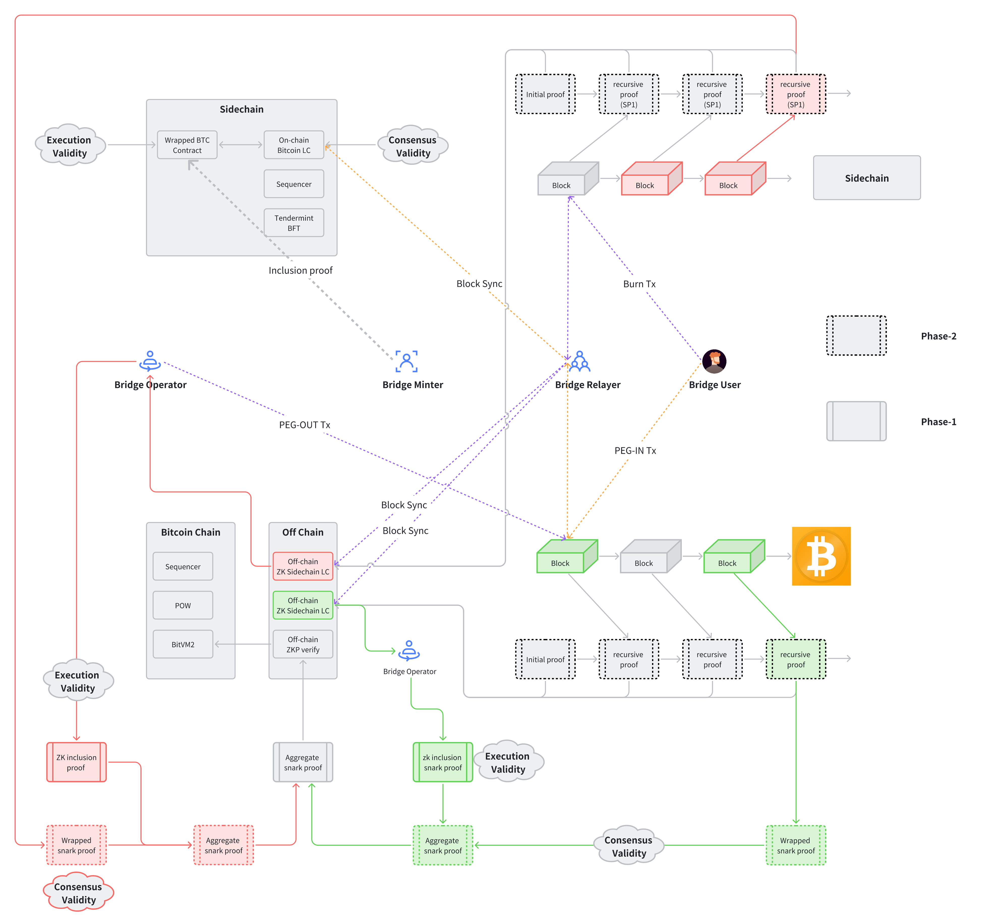

# Consensus Proof

## Introduction

A bridge typically enables asset transfers between two chains. In this discussion, we focus on bridge designs between Bitcoin and a programmable blockchain (e.g., Ethereum, Solana, etc.).

The process of moving from Bitcoin to another blockchain is referred to as PEG-IN; conversely, moving from the other blockchain back to Bitcoin is called PEG-OUT. For PEG-IN, trust is placed in the destination chain, as critical modules operate there, including:

1. Building a Bitcoin light client
2. The wrapped/tokenized BTC contract
3. Execution of the minting function

For PEG-OUT, we rely on Bitcoin. However, limitations in Bitcoin's programmability prevent direct construction or execution of:

1. A light client for the other chain (we can also call the chain sidechain or side system of Bitcoin)&#x20;
2. Complex script logic to trigger transactions
3. Data access to verify information validity, such as block header data

Additionally, we aim to avoid introducing trust assumptions outside the Bitcoin network. Therefore, PEG-OUT processes are relatively complex. Below is the envisioned final version of the bridge design.

<figure><figcaption></figcaption></figure>

For cross-chain transactions, two key aspects must be ensured:

1. Execution validity: Validity of transaction execution
2. Consensus validity: Validity of the block that includes the transaction

For PEG-IN, we use the following methods to ensure these properties

1. Consensus validity: Construct a Bitcoin light client on the sidechain, which adheres to Bitcoin's block verification logic, ensuring block validity
2. Execution validity: The minter provides an inclusion proof to ensure the PEG-IN transaction is contained within a valid block, confirming transaction validity

To achieve bridge fungibility for PEG-OUT, we introduce an operator. The normal PEG-OUT process is:

1. The user initiates a burn transaction on the sidechain
2. The operator verifies the burn transaction's validity and initiates the compensated PEG-OUT transaction

For these steps, it's crucial to ensure:

1. Consensus validity of the block containing the burn transaction: For POS sidechains, this generally involves checking the coverage of block signers; if they exceed 1/3, the block is considered valid.
2. Execution validity of the burn transaction: The burn transaction is contained within a valid block.
3. Consensus validity of the block containing the PEG-OUT transaction: This mainly involves verifying blockhead linkage and longest-chain verification.
4. Execution validity of the PEG-OUT transaction: The PEG-OUT transaction is included in a valid block.

## Execution Validity and Consensus Validity

Achieving execution validity is straightforward, as a transaction inclusion proof (either ZK or Merkle proof) suffices. However, consensus validity is more complex, as verifying block validity generally requires checking the entire consensus process, which is intricate. Therefore, we approach this by analyzing from a verification perspective for POS and POW chains:

1. For POS chains, a block is valid if:
   1. The combined voting weight of current block signers exceeds 2/3 of total weight,
   2. A subset of signers for the current block are also signers of previous confirmed blocks, with a combined weight exceeding 1/3 of the current block's total weight,
   3. Consistency checks between blocks are in place to prevent tampering when validator sets change by more than 2/3. For more details, refer to Succinctlabs' [ZKTendermint](https://github.com/succinctlabs/tendermintx?tab=readme-ov-file).
2. For POW chains, a block is valid if:
   1. Blockhead validation: This includes verifying the hash, timestamp, and difficulty adjustment,
   2. Longest-chain validation: Ensuring the block is part of the longest chain. See the [ZK Bitcoin Light Client](https://github.com/keep-starknet-strange/raito) repository for more information.

## Chain Proof (Recursive Proof)

To verify the state of a chain, one could either re-execute every transaction from the genesis block or verify only block headers; however, both are costly. An ideal approach is to generate a recursive ZK proof for the chain, similar to the Mina blockchain, which uses a fixed-size proof (\~22 KB) to represent the latest chain state. Thus, verifying the latest proof alone confirms the entire chain's validity.

For PoS chains, we only need to encapsulate the logic described in the previous section on "how to ensure the validity verification of PoS chain blocks" into a ZK circuit. By combining this with the proof's verification process into a recursive circuit, we can, similar to Mina, verify the chain's validity through the latest proof, thereby ensuring block validity and achieving consensus validity verification.

For POW chains, beyond simply building a recursive circuit, we also need to address the longest-chain problem. In POW chains, "orphaned blocks" (blocks that pass all checks but are not accepted by the network) can occur. Transactions in these blocks are re-added to the mempool to be mined again. Assuming confirmation after K blocks for validity, proof of block N's validity requires providing the recursive proof for block N+K.

## Explanation on the public input of recursive proof

Recursive proofs possess excellent compression properties; the size of the proof is constant. However, a downside is that as the number of recursions increases, the size of the public input also increases linearly. The linear increase in public input affects:

1. The dynamic changes in scripts, leading to the transformation of taproot addresses;
2. This implies more data is disclosed on Bitcoin, gradually increasing costs.

<figure><figcaption></figcaption></figure>

Solutions:

1. Increase hash circuits on the prover's side, using only the hash output as the public input. This ensures the proof size remains constant while also stabilizing the size of the public input.

<figure><figcaption></figcaption></figure>

2. K-depth confirmation: To ensure the verification of the longest chain, it is necessary to ensure that there are K blocks following a given block.This requires us to consistently make the current block and the information of the k-th block publicly available as public info for verification in scripts to check if a block has K confirmations (Check height\_k - height\_0 = k). (This is a requirement for the prover to set the information of the last K blocks as public input attributes.)

<figure><figcaption>
Assume K=3
</figcaption></figure>

## Proof Aggregation

In the bridge design, consensus validity and execution validity are verified with separate proofs, yet these two characteristics are inherently linked by the requirement for consistent blockhead information. If verified independently, the bridge design faces issues such as:

1. Doubling total script size,
2. Doubling total script chunk count,
3. Increased data disclosure in the happy path, raising costs,
4. Increased data disclosure in the unhappy path, raising challenge costs.

Proof aggregation addresses these issues by verifying both proofs in a single step, removing the above challenges. Notably, mature proof aggregation methods currently use the SNARK algorithm, as folding-based approaches are not yet commercially available.
