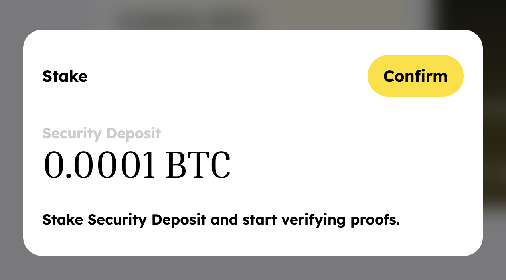

# Multi-Operators

The operator's primary role is to assist users in redeeming BTC by fronting their own BTC to complete the payment, then permissionlessly claiming the locked BTC that was secured by the user during the pre-signed phase.

Since users depend on operators for BTC redemption, having multiple operators ensures the bridge's liveness. As long as at least one operator remains active, users can successfully redeem their BTC.

<figure><figcaption>
Multi-operators
</figcaption></figure>

When a user deposits BTC into the Fiamma Bridge, the funds are transferred to a Taproot address jointly controlled by the user and the bridge committee. The user, bridge committee, and operator then collaboratively pre-sign a set of transactions that define how operators can later claim the BTC.

If multiple operators are involved, the user and bridge committee pre-sign these transactions individually with each operator. This ensures that any operator can initiate a redemption, but only one can successfully complete it—preventing double-spending while maintaining redundancy.

This multi-operator design guarantees service availability: if one operator goes offline, others can still process redemptions, ensuring users can always retrieve their BTC.

To learn more about running an operator node, please check: [https://app.gitbook.com/o/pCAnNlKAzOo8rYFBd4MY/s/NaWxhWAPbrPeq8rIwJHB/\~/changes/65/our-product-suite/pragmatically-trustless-bitvm-bitcoin-bridge/user-guides/testnet-beta/how-to-run-an-operator](user-guides/testnet-beta/how-to-run-the-fiamma-operator/)

