# How to Deposit and Withdraw on Fiamma Bridge?

Prerequisite

To begin, you'll need wallets that support EVM-compatible and BTC addresses, along with the corresponding test tokens.

* Bitcoin Signet
  * Wallet: [Unisat](https://unisat.io/) (others coming soon)
  * Faucet: [https://signetfaucet.bublina.eu.org/](https://signetfaucet.bublina.eu.org/)
* Ethereum Holesky Testnet
  * Wallet: [Metamask](https://metamask.io/) and others
  * Faucet: [https://www.holeskyfaucet.io/](https://www.holeskyfaucet.io/)

## How to Deposit

> Transfer sBTC from Signet to Holesky Testnet.

1. Connect Bitcoin Wallet - Unisat

<figure>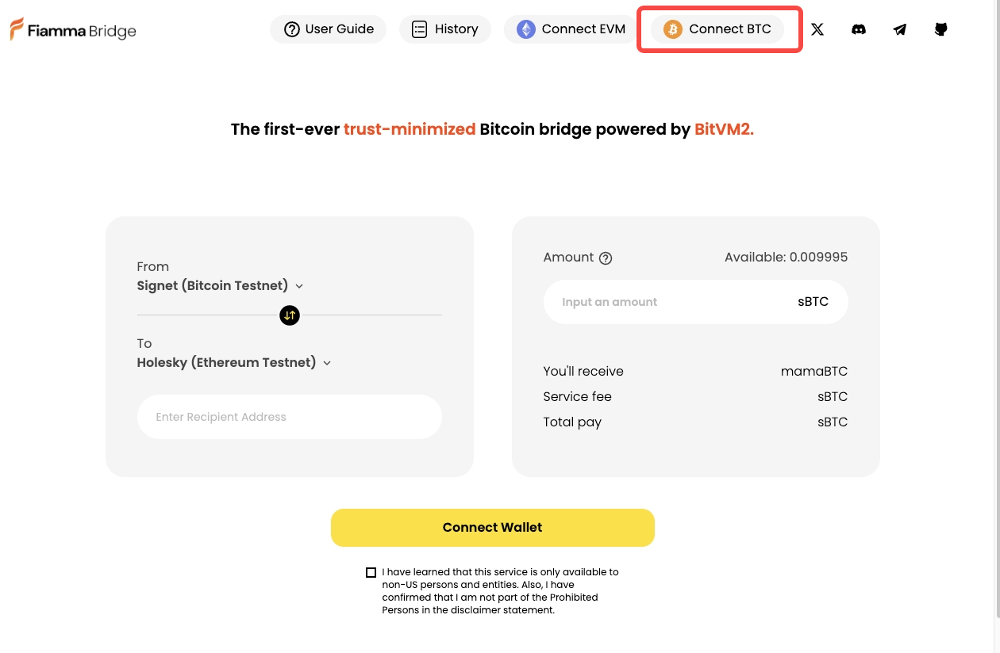<figcaption></figcaption></figure>

Please note that we only support Native Segwit and Taproot address types in alpha-testnet.&#x20;

<figure>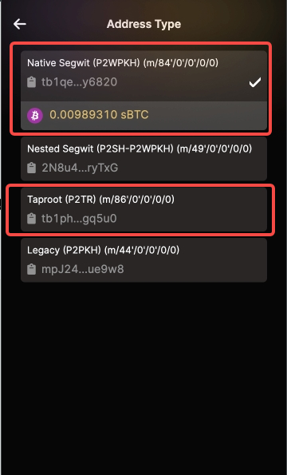<figcaption></figcaption></figure>

2. Enter amount within `0.00001 ~ 0.0001sBTC`(Due to current liquidity constraints in our operator, we have implemented a temporary limit on amounts. We anticipate increasing these limits.)

<figure>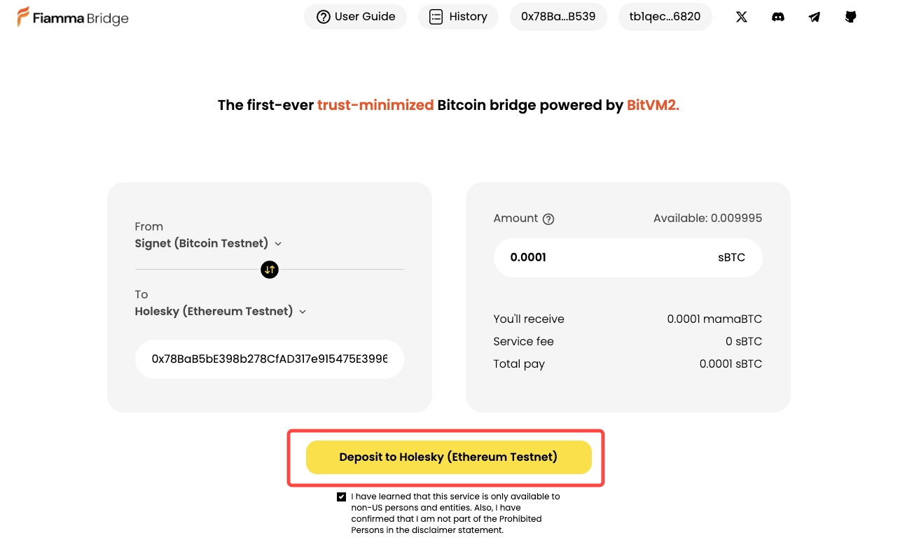<figcaption></figcaption></figure>

3. Please enter the recipient's address in the designated field, ensuring it is an ERC20-compatible address from the Holesky network.

> Or just connecting with the Metamask, which will autofill the address.

<figure><figcaption></figcaption></figure>

4. Confirm and hit deposit

<figure>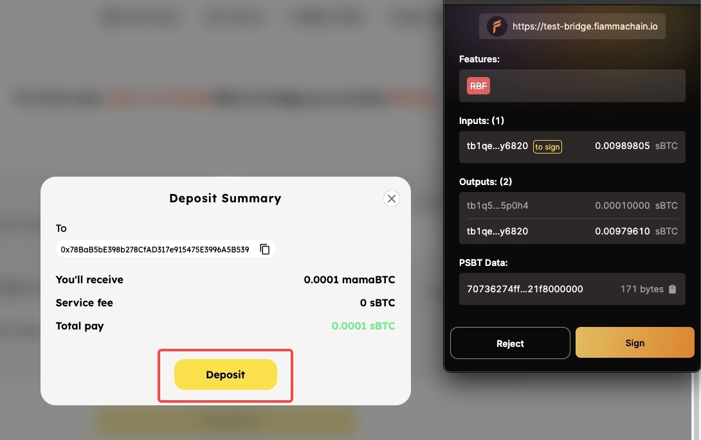<figcaption></figcaption></figure>

5. Sign `PEG-IN` (Deposit) Transaction and pre-sign Take Transactions, which is prepared to pay back for Operator when they finish `PEG-OUT` (withdraw) operation.

<figure><figcaption></figcaption></figure>

6. It will then proceed with processing.
7. Check your deposit (Peg-in) status by clicking the deposit transaction. &#x20;

<figure>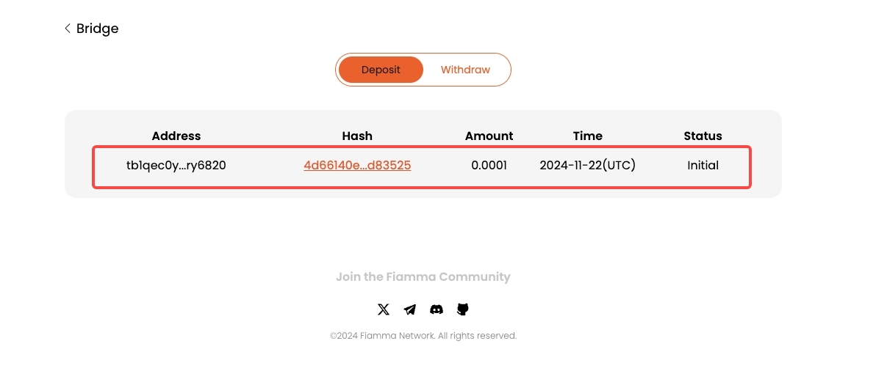<figcaption></figcaption></figure>

<figure><figcaption></figcaption></figure>

<figure>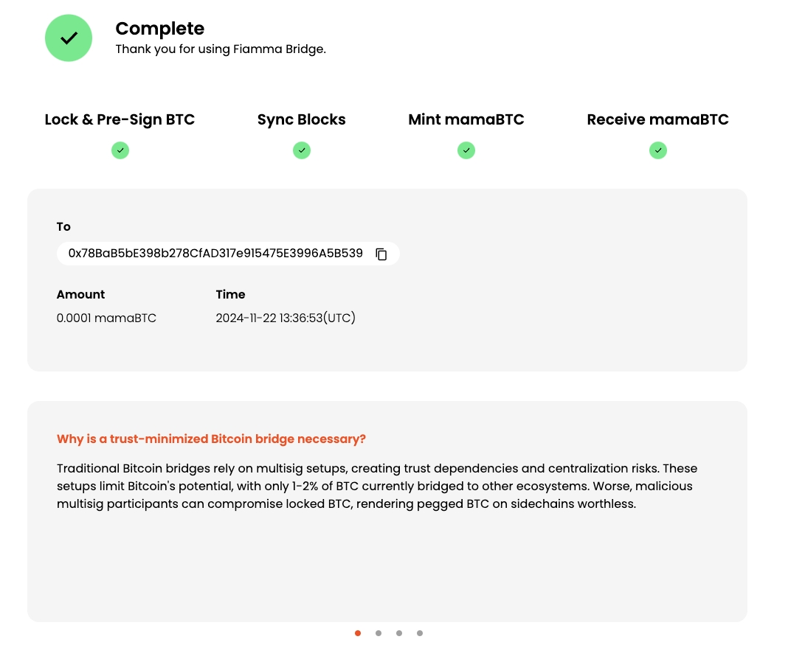<figcaption></figcaption></figure>

<figure>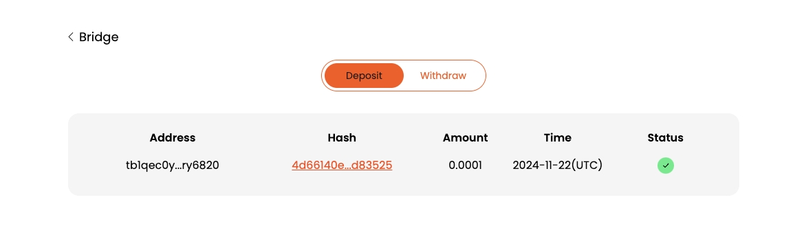<figcaption></figcaption></figure>

8.  Check your bridged BTC (mamaBTC) on Sidechain wallet.

    1. Add mamaBTC **`0x5636bB012F5176d75755691B623236971126Fdac`**  on Metamask
    2. Check the amount.

    <figure>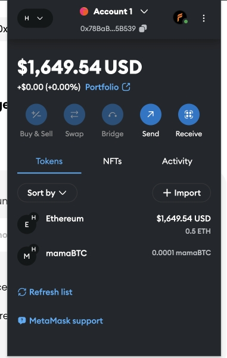<figcaption></figcaption></figure>

## How to `PEG-OUT`

1. Connect EVM-compatible wallets (e.g., Metamask)

<figure>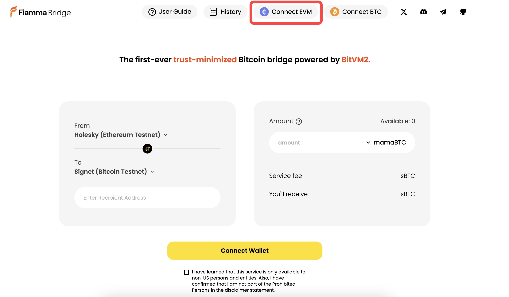<figcaption></figcaption></figure>

2. Select `PEG-OUT` Amount (We will bring in external liquidity provider to achieve fully flexible amount in the future.)

<figure>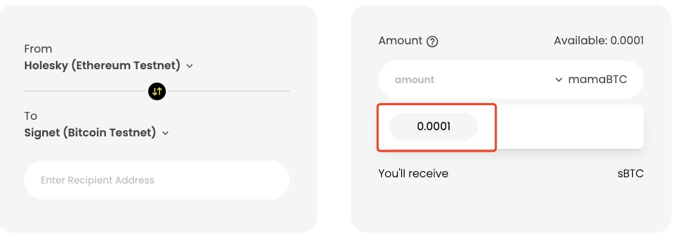<figcaption></figcaption></figure>

3. Fill out the recipient address on Bitcoin.

<figure>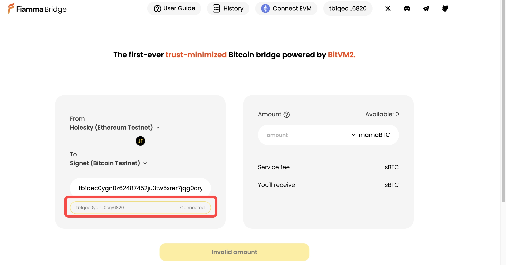<figcaption></figcaption></figure>

4. Confirm and Withdraw
   1. Withdraw

<figure><figcaption></figcaption></figure>

b. Confirm Withdraw and Sign Burn Transaction

<figure>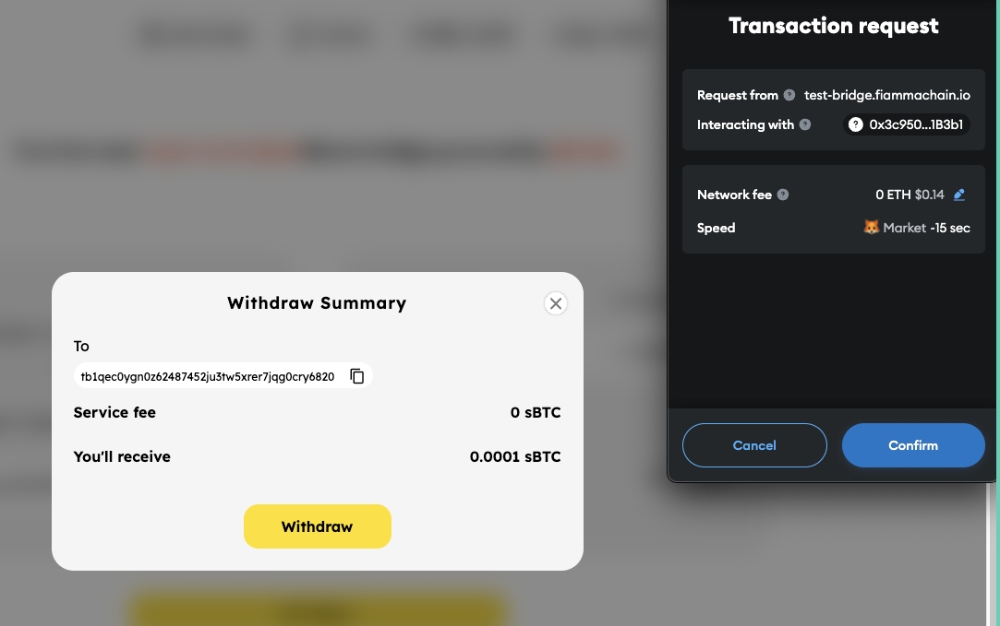<figcaption></figcaption></figure>

5. Processing.&#x20;
6. Check your PEG-OUT (withdraw) status in history.

> This process may take 10-20 minutes to be confirmed on the Signet.

<figure><figcaption></figcaption></figure>

<figure>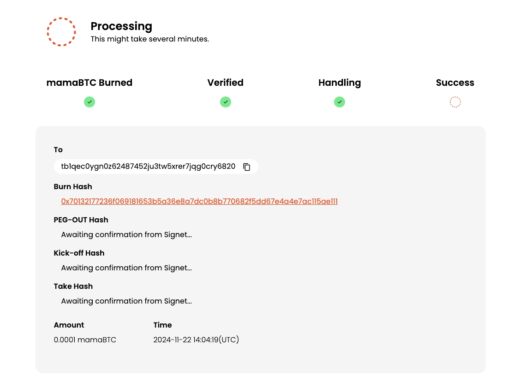<figcaption></figcaption></figure>

<figure><figcaption></figcaption></figure>

