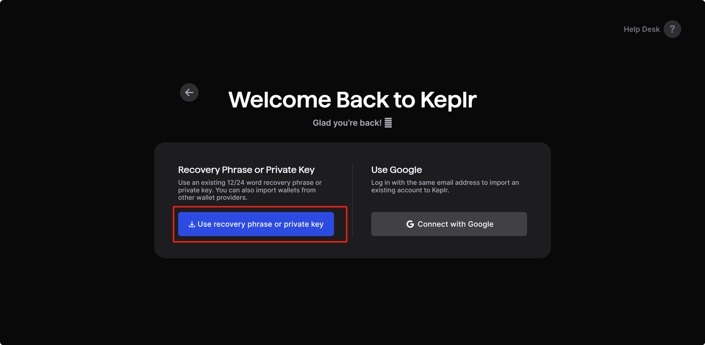

# add keys
Usage:
  `fiammad keys add <name> [flags]`
Example:
  `fiammad keys add test-alice --keyring-backend=test`

A Fiamma address named with test-alice will be automatically generated such as:
```
- address: fiammaXXX
  name: test-alice
  pubkey: '{"@type":"/cosmos.crypto.secp256k1.PubKey","key":"XXX"}'
  type: local


**Important** write this mnemonic phrase in a safe place.
It is the only way to recover your account if you ever forget your password.

XXX
```
Please securely store your MNEMONIC, PUBKEY

# list keys
Usage:
  `fiammad keys list [flags]`
Example:
  `fiammad keys list --keyring-backend=test`
Then the address with test-alice will be shown.

# Store Keys in Keplr Wallet
Fiamma Testnet has been integrated with the Keplr wallet. Please refer to [Connect Keplr Wallet](./wallet-and-tokens.md#connect-keplr-wallet) for more details. To better manage your Fiamma address, you can import it into your Keplr wallet by following these steps.

Visit the Keplr Chains website at [keplr app](https://chains.keplr.app), search for "Fiamma Testnet" and add it to your Keplr wallet.

Open the Keplr wallet extension and click the user avatar in the top right corner. Select "Add Wallet," then choose either "Import an existing wallet" or "Create a new wallet." Opt for the "24 words recovery phrase" and enter your mnemonic phrase, or opt for the "private key" and enter your unarmored hex private key.


Use Recovery Phrase or Private Key to Import Keys into Keplr Wallet:
<figure><figcaption></figcaption></figure>

Set a custom name for your wallet, select "Fiamma Testnet" Chain and confirm. Your Fiamma address will now appear in the Keplr wallet extension, ready for receive and send transactions. For more faucet details, please refer to [Get FIA](./wallet-and-tokens.md#get-fia).