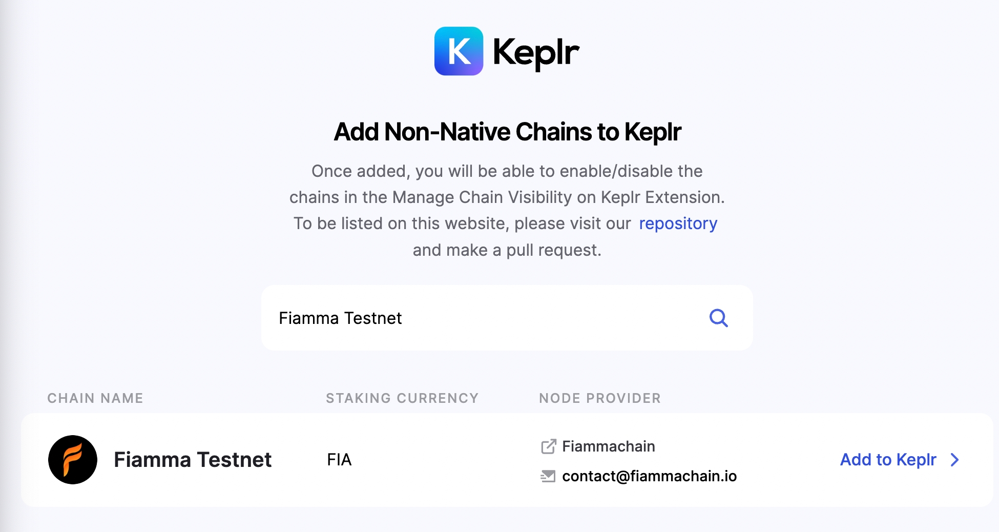
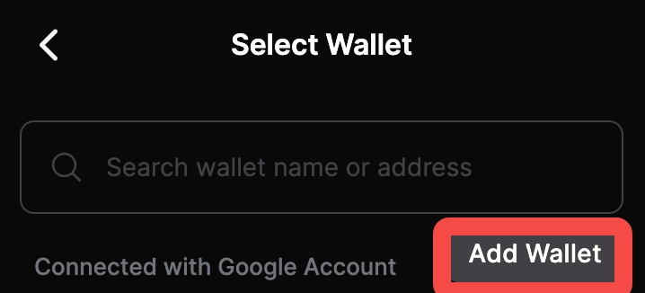
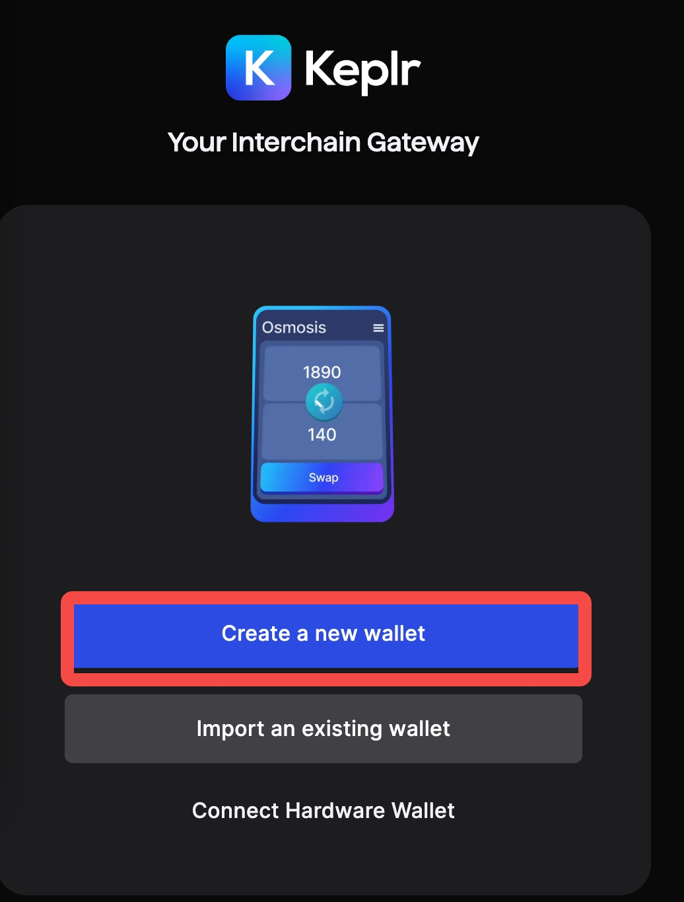
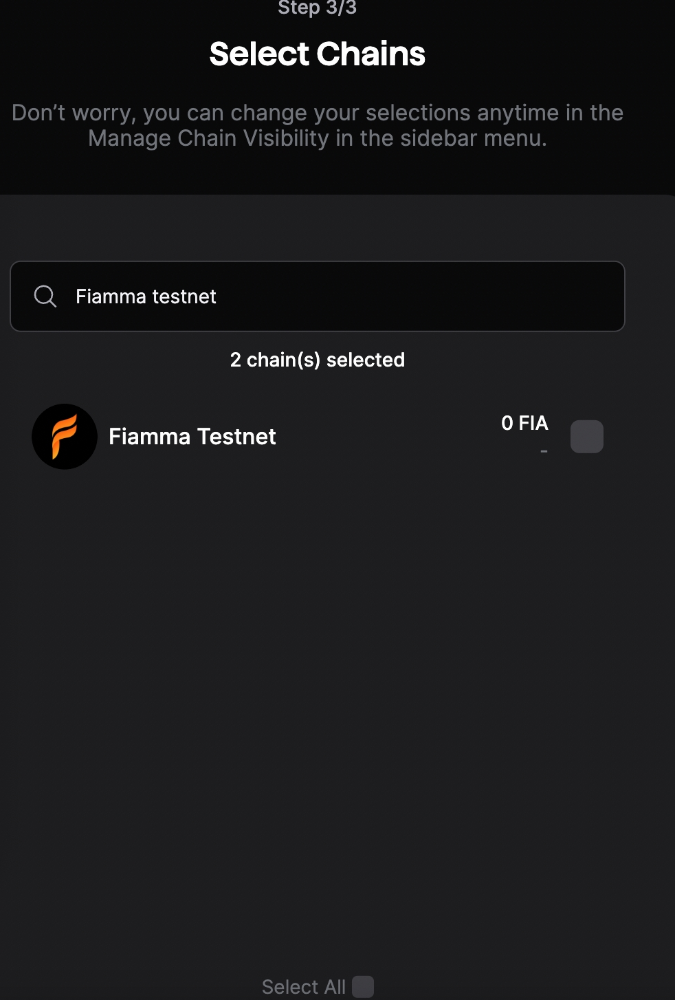

# Connect Keplr Wallet

## Connect Keplr Wallet


**Note**: We are in the Testnet stage, so the API may undergo incompatible changes in the future. If you encounter any issues, please join our [Discord](https://discord.com/invite/8mCBXXjgvA) to get in touch with the Fiamma Team.


[Keplr Wallet | First and Leading IBC Wallet](https://www.keplr.app/)

### Add Fiamma Testnet Chain

Visit [https://chains.keplr.app](https://chains.keplr.app) search for "**Fiamma Testnet**" and add it to your Keplr wallet.

Add "**Fiamma Testnet**" Chain to Keplr:

<figure><figcaption></figcaption></figure>

### Create a Wallet with Fiamma Address

Open the Keplr wallet extension, click the user avatar in the top right corner, and select "**Add Wallet**" on the Select Wallet page.

Add Wallet in Keplr:

<figure><figcaption></figcaption></figure>

On the new page, choose "**Create a new wallet**". If you want to import an existing wallet from fiamma-node, please refer to [Manage Keys](../manage-keys.md).

Create a new wallet:

<figure><figcaption></figcaption></figure>

Then follow the steps to sign in and set a custom name for your wallet. In the third step, select the chain for your wallet. Search for "**Fiamma Testnet**" and check the box to confirm.

Select "**Fiamma Testnet" Chain**:

<figure><figcaption></figcaption></figure>

You will now see your Fiamma address in the Keplr wallet. To get testnet FIA from our faucet, please refer to [Get FIA](wallet-and-tokens-1.md).
